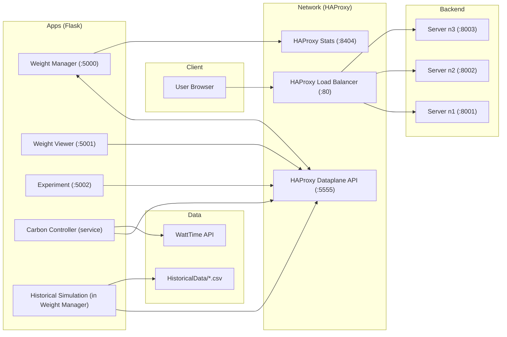

# 🌱 Green CDN - Carbon-Aware Load Balancing System

Core: a green (carbon‑aware) load balancer that routes more traffic to cleaner regions.

A complete environment for carbon‑aware load balancing with two complementary paths:

- Real-Time Mode (WattTime API): live carbon intensity drives HAProxy weights now
- Historical Simulation Mode (CSV): replays past data hour-by-hour and actually updates HAProxy weights via the Dataplane API to show how routing would have changed over time

Quick highlights
- HAProxy Dataplane API is used in both modes to set backend weights (higher weight → more traffic)
- Historical Simulation includes a dashboard to monitor simulated time, real HAProxy weights, and cumulative carbon saved vs round-robin
- Graphs include clear “what it shows” and “why it matters” explanations (see below)

What makes it green
- Carbon‑aware weights: lower grid carbon intensity → higher HAProxy weight → more traffic
- Real data via WattTime (when configured) or historical CSV replay for demos
- Transparent visuals to explain the environmental impact (carbon timeline, weights, cumulative savings)

Historical Simulation (what’s included now)
- Choose a date range within the CSV coverage (e.g., Dec 2022)
- Pick requests-per-hour and simulation speed (e.g., 2×)
- The engine replays the period hour-by-hour, computes carbon-aware weights, applies them to HAProxy, and tracks cumulative carbon savings

Graph meanings (keep these in the UI so it’s clear)
- Carbon Timeline (demo): hourly carbon intensity for a historical sample; daily cycles; lower values = cleaner periods
- Renewable Energy (demo): historical renewable %; higher renewable share generally aligns with lower carbon intensity
- Regional Comparison (demo): snapshot comparison of regional carbon intensity; highlights cleaner vs dirtier regions at a point in time
- Pattern Analysis (demo): “typical day” curve using hourly averages; this is an average, not a prediction
- Simulation Dashboard: shows actual HAProxy weights (live updates) and cumulative carbon saved vs round-robin (in kg)

Notes to make simulation meaningful
- Normalize timestamps (CSV vs selected dates) to the same timezone (UTC) to avoid “offset-naive vs offset-aware” errors
- Use larger request totals (e.g., 1000+ per hour) to see clear distribution differences
- Add more charts over time: carbon per region, request distribution over time, weight changes over time


## 🏗️ **Complete System Architecture**

### 🌐 **Services**
- **3 Web Servers** (US West, Central, East) - `localhost:8001-8003`
- **HAProxy Load Balancer** - `localhost:80` (main traffic)
- **Weight Manager Dashboard** - `localhost:5000` 
- **Weight Viewer App** - `localhost:5001`
- **HAProxy Stats Dashboard** - `localhost:8404`
- **HAProxy Dataplane API** - `localhost:5555`
- **Carbon Controller** - Background service for auto-updates

### System Diagram



## 🚀 **Quick Start**

### Prerequisites
- **Docker Desktop** (required): install for your OS → [Docker Desktop](https://www.docker.com/products/docker-desktop/)
- **Git** (optional, to clone): [Git](https://git-scm.com/downloads)
- **Make** (optional, Linux/macOS): typically preinstalled; otherwise via your package manager
- Shell: Bash (Linux/macOS) or PowerShell (Windows)

### Step-by-step (Playground)
1) Clone and enter the project directory
```bash
git clone https://github.com/your-org/greenCDN.git
cd greenCDN
```

2) Create `.env` (demo defaults) and optionally set WattTime credentials
```bash
cp env_example.txt .env
# Then edit .env to add:
# WATTTIME_USERNAME=your_username
# WATTTIME_PASSWORD=your_password
```

3) Start with the helper scripts
- Linux/macOS
```bash
chmod +x scripts/playground.sh
scripts/playground.sh
```
- Windows PowerShell
```powershell
scripts/playground.ps1
```

Alternative: start manually
```bash
# Compose directly
docker-compose up -d

# Or Make (Linux/macOS)
make build && make up
```

4) Access dashboards
- Weight Manager: http://localhost:5000
- Weight Viewer: http://localhost:5001
- HAProxy Stats: http://localhost:8404/stats
- Test Load Balancer: http://localhost:80
- Historical Simulation: http://localhost:5000/historical-simulation

5) Stop / clean up
```bash
docker-compose down
# or
make down
```

### 1. **Setup Environment**
```bash
cp env_example.txt .env
# Edit .env with your WattTime credentials
```

### 2. **Start All Services**
```bash
docker-compose up -d
```

Or use the included helpers:

```bash
# Linux/macOS
scripts/playground.sh

# Windows PowerShell
scripts/playground.ps1

# Make targets (Linux/macOS)
make build
make up
make logs
make down
```

### 3. **Access Dashboards**
- **Weight Manager**: http://localhost:5000
- **Weight Viewer**: http://localhost:5001  
- **HAProxy Stats**: http://localhost:8404/stats
- **Test Load Balancer**: http://localhost:80
 - **Historical Simulation Dashboard**: http://localhost:5000/historical-simulation

## ✨ **Features**

### 🏆 **Weight Viewer App (Port 5001)**
- Shows which server currently has the **highest weight**
- Real-time traffic share percentages
- Ranked list of all servers
- Auto-refreshes every 30 seconds
- Premium glassmorphism UI with live data

### 📊 **Integrated HAProxy Dashboard**
- Access HAProxy's built-in stats dashboard
- Monitor real-time traffic distribution
- View server health and connection stats
- Available through Weight Manager or directly

### 🤖 **Continuous Carbon Controller**
- Background service that automatically updates weights
- 5-minute intervals for carbon intensity checks
- Real WattTime data for California (CAISO_NORTH)
- Simulated data for Texas and Mid-Atlantic regions
- Automatic failover and error handling

### 🐳 **Complete Docker Environment**
- 3 echo servers representing different regions
- Full HAProxy setup with dataplane API
- Networked services for container communication
- Production-ready configuration

## 🎯 **How It Works**

### **Carbon-Aware Routing**
1. **WattTime API** provides real-time carbon intensity data
2. **Carbon Controller** fetches data every 5 minutes
3. **Weight Calculator** converts carbon data to HAProxy weights:
   - **Lower carbon = Higher weight = More traffic**
   - **Higher carbon = Lower weight = Less traffic**
4. **HAProxy** routes traffic based on weights
5. **Dashboards** show live results

### **Server Regions**
- **n1**: California (CAISO_NORTH) - **Real WattTime data**
- **n2**: Texas (ERCOT) - **Simulated data** (500 base intensity)
- **n3**: Mid-Atlantic (PJM) - **Simulated data** (700 base intensity)

## 📱 **Dashboard Overview**

### **Weight Manager (localhost:5000)**
- 🌱 **Carbon-Based Updates**: Auto-calculate weights from live carbon data
- ⚖️ **Manual Weight Control**: Set individual server weights (1-256)
- **Quick Presets**: Equal, West Heavy, Central Heavy, East Heavy, Reset
- **Live Carbon Display**: See carbon intensity on each server card
- **Dashboard Links**: Direct access to stats and viewer apps
- **Toast Notifications**: Real-time feedback for all updates

### **Weight Viewer (localhost:5001)**
- 🏆 **Traffic Leader**: Shows server with highest weight
- **Ranked List**: All servers sorted by weight
- **Traffic Percentages**: Real-time distribution
- **Auto-Refresh**: Updates every 30 seconds
- **Premium UI**: Clean glassmorphism design with live stats

### **HAProxy Stats (localhost:8404/stats)**
- **Real-time Metrics**: Connections, response times, health
- **Admin Controls**: Enable/disable servers, change weights
- **Historical Data**: Server performance over time
- **Health Monitoring**: Server status and alerts

## 🔧 **Manual Testing**

### **Test Carbon-Aware Routing**
1. Go to **Weight Manager** (localhost:5000)
2. Click **"🌱 Update Carbon Weights"**
3. Watch weights change based on carbon intensity
4. Check **Weight Viewer** (localhost:5001) to see new leader
5. Test actual traffic: `curl http://localhost:80`

### **Test Manual Weight Changes**
1. Set **n1** weight to **200**, others to **50**
2. Check **Weight Viewer** - n1 should be the leader
3. Test traffic distribution with multiple requests
4. View results in **HAProxy Stats**

### **Test Different Presets**
- **Equal** (50/50/50): Balanced distribution
- **West Heavy** (100/30/20): California gets most traffic
- **Central Heavy** (20/100/30): Texas gets most traffic
- **East Heavy** (20/30/100): Mid-Atlantic gets most traffic

## 🌱 **Carbon Data Sources**

### **Real Data (California)**
- Uses WattTime v3 API
- Updates every 5 minutes
- Actual grid carbon intensity

### **Simulated Data (Texas & Mid-Atlantic)**
- Realistic time-based patterns
- Higher during day, lower at night
- Random variation (±20%)
- Baseline: Texas=500, Mid-Atlantic=700 lbs CO2/MWh

## 🔄 **System Monitoring**

### **Check All Services**
```bash
docker-compose ps
```

### **View Logs**
```bash
# All services
docker-compose logs -f

# Specific service
docker-compose logs -f carbon-controller
docker-compose logs -f weight-manager
docker-compose logs -f haproxy
```

### **System Status API**
```bash
curl http://localhost:5000/system-status
```

## 🐛 **Troubleshooting**

### **Services Not Starting**
```bash
# Check Docker status
docker-compose ps

# Restart specific service
docker-compose restart haproxy
docker-compose restart carbon-controller
```

### **No Carbon Data**
- Check WattTime credentials in `.env`
- Verify internet connectivity
- Check carbon-controller logs: `docker-compose logs carbon-controller`

### **Weight Changes Not Working**
- Check HAProxy Dataplane API at `localhost:5555`
- Verify all services are running: `docker-compose ps`
- Check weight-manager logs: `docker-compose logs weight-manager`

## 🎨 **UI Features**

### **Premium Design**
- Clean glassmorphism interface
- Minimal, essential emojis only
- Professional color palette (white majority, green accents, minimal yellow)
- Smooth animations and transitions

### **Toast Notifications**
- Real-time feedback for weight updates
- Staggered display for multiple changes
- Professional styling with glassmorphism effects
- Auto-dismiss with manual close option

### **Responsive Layout**
- Works on desktop and mobile
- Adaptive card layouts
- Touch-friendly controls
- Progressive enhancement


